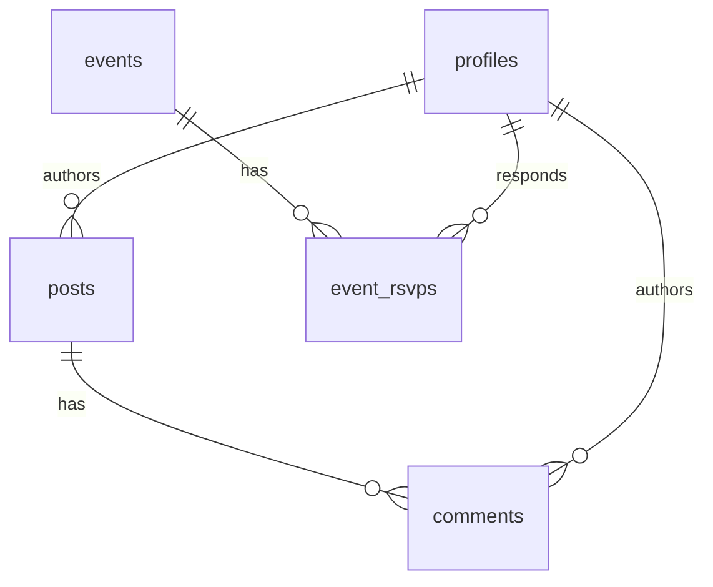

# Backend Development Skill

Backend Engineer 에이전트가 사용. 데이터 모델·API·권한을 일관되게 설계하고 실제 마이그레이션을 생성한다.

기본 가정: **Supabase (Postgres + Auth + RLS + Storage)**. 사용자가 다른 스택을 지정하면 그에 맞춰 출력 형식만 조정.

## 워크플로우

### 1. 도메인 모델 도출
PM 요구사항에서 명사를 뽑아 엔티티 후보 생성. 원우회 도메인의 표준 엔티티:
- `profiles` (auth.users 확장: student_id, cohort, role, lab, status)
- `notices` (공지)
- `posts` (게시글, category로 자유/질문 등 구분)
- `comments`
- `events` (일정)
- `event_rsvps`
- `dues` (회비 납부 기록)
- `notifications`
- `attachments` (storage 파일 메타)

다대다는 조인 테이블로 명시 (`event_rsvps`처럼).

### 2. ERD 작성
Mermaid `erDiagram`으로 관계 표현:



### 3. DDL + 마이그레이션 파일 생성
`supabase/migrations/{timestamp}_{name}.sql` 형식. 표준 컬럼:
- `id uuid primary key default gen_random_uuid()`
- `created_at timestamptz default now()`
- `updated_at timestamptz default now()`
- `deleted_at timestamptz` (소프트 삭제)
- `created_by uuid references auth.users(id)`

인덱스: 외래키, 자주 조회되는 컬럼(`category`, `created_at desc`), 한국어 검색 시 `to_tsvector`.

### 4. RLS 정책
모든 테이블에 `alter table {t} enable row level security` 필수. 정책 작성 패턴:

```sql
-- 공지: 회원 모두 읽기, 임원만 쓰기
create policy "notices_select_member" on notices
  for select to authenticated
  using (
    exists(select 1 from profiles where id = auth.uid() and status = 'active')
  );

create policy "notices_insert_officer" on notices
  for insert to authenticated
  with check (
    exists(select 1 from profiles where id = auth.uid() and role in ('officer','admin'))
  );
```

자기 데이터 수정 정책은 `auth.uid() = created_by` 패턴.

### 5. API 엔드포인트 명세
Next.js에서 Supabase 클라이언트를 직접 쓰는 경우가 많으므로 REST 명세보다 **호출 패턴 + 응답 shape**을 명시:

```ts
// listNotices(limit=20, cursor?)
const { data, error } = await supabase
  .from('notices')
  .select('id, title, body, pinned, created_at, author:profiles!created_by(name, role)')
  .is('deleted_at', null)
  .order('pinned', { ascending: false })
  .order('created_at', { ascending: false })
  .limit(limit);
// Returns: Notice[] where Notice = { id, title, body, pinned, created_at, author: { name, role } }
```

서버 액션이 필요한 경우(권한 검증, 트랜잭션)만 별도 API 라우트(`app/api/.../route.ts`).

### 6. 인증 흐름
- 가입: 이메일+비번 → 이메일 인증 → 학번/이름 입력 → `profiles.status = 'pending'` → 임원 승인 → `'active'`
- 세션: Supabase 기본 (httpOnly 쿠키), Next.js middleware로 보호 라우트 처리
- 비밀번호 재설정: Supabase OTP

### 7. 외부 통합 (선택)
- 푸시: Web Push (PWA) 또는 FCM
- 이메일: Supabase 내장 또는 Resend
- 결제(회비): MVP에선 보통 수동 등록, 자동화는 P2

## 출력 형식
- `_workspace/03_backend_design.md` — 위 7개 섹션 종합 문서
- `supabase/migrations/*.sql` — 실행 가능한 SQL
- (선택) `supabase/seed.sql` — 개발용 시드

## 재실행 시
- 마이그레이션은 **add-only**. 기존 파일 수정 금지. 컬럼 변경은 새 마이그레이션으로.
- ERD 변경 시 사유를 문서 상단 변경 로그에 기록.
