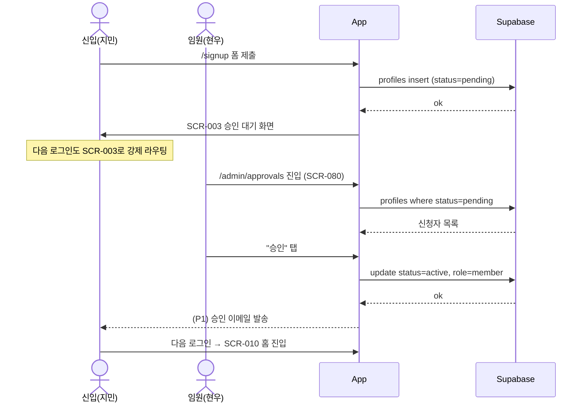
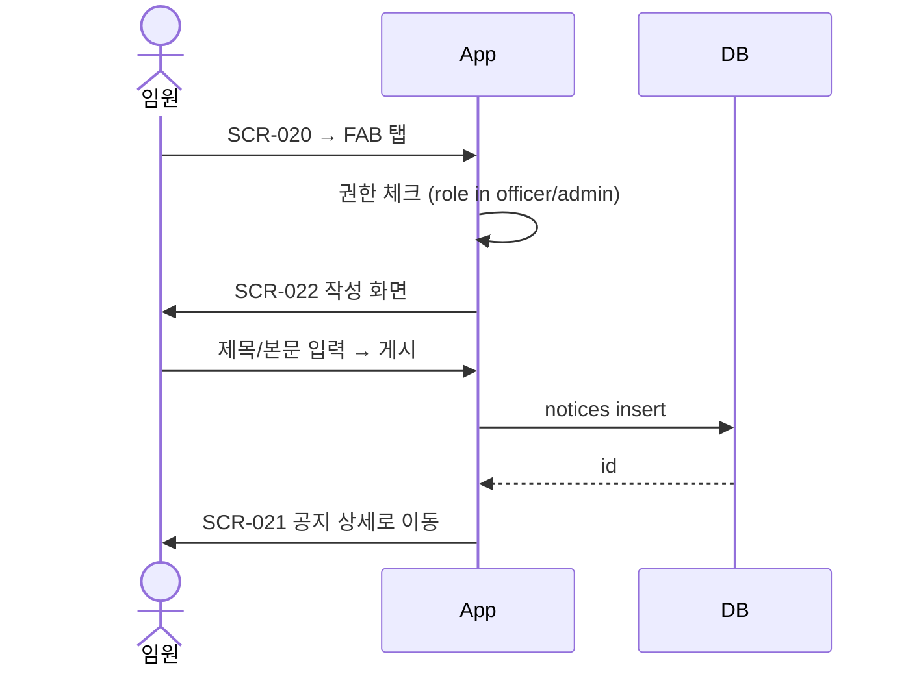
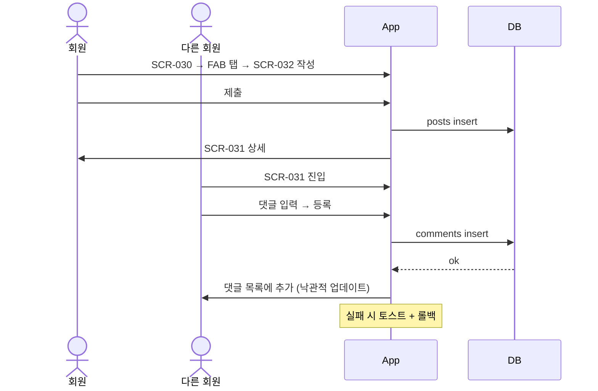
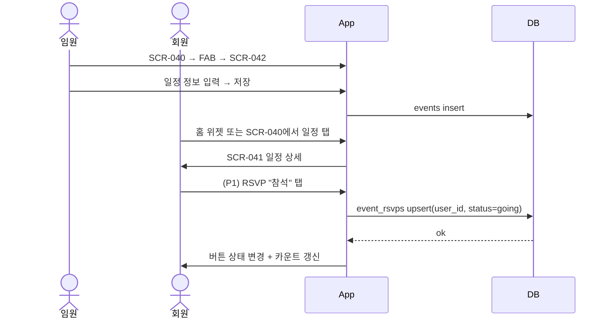
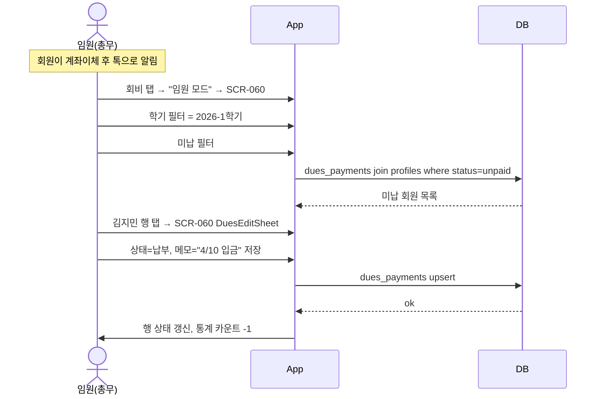
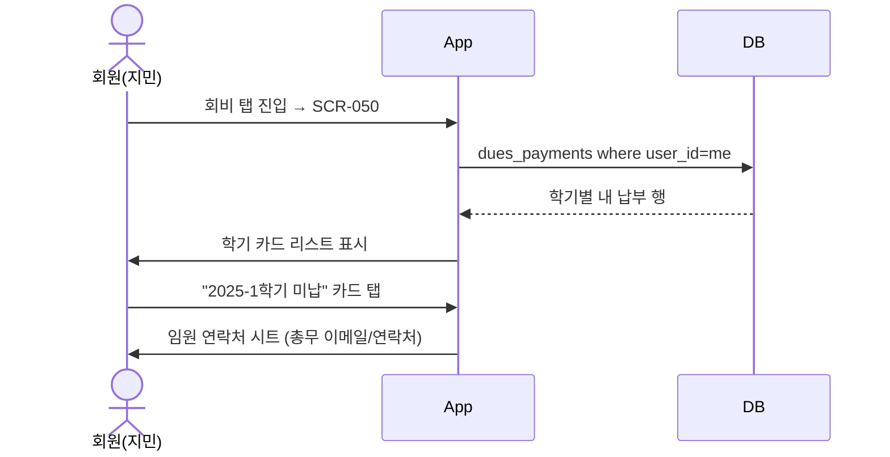

# 02. Designer UI/UX 설계서 — 대학원 원우회 커뮤니티 앱

> 작성자: Designer 에이전트
> 작성일: 2026-05-20
> 기반: `_workspace/01_pm_requirements.md` v0.2
> 대상 뷰포트: 모바일 우선 360~390px (데스크톱은 컨테이너 폭 제한으로 확장)

## 변경 로그
| 날짜 | 버전 | 변경 사유 |
|------|------|----------|
| 2026-05-20 | v0.1 | PM v0.2 기반 최초 작성. 회비 P0 반영(임원/회원 화면 분리), 가입 승인 대기 화면 신설. |

---

## 1. 정보 구조 (IA)

### 1.1 진입 IA (인증 전)
```
/ (랜딩 = 로그인 화면)
├─ /signup            가입 신청
├─ /signup/pending    승인 대기 안내 (status=pending)
├─ /login             로그인
└─ /reset             비밀번호 재설정 (AUTO-ADDED, US-04 P1이지만 시스템 화면이라 P0 진입선 확보)
```

### 1.2 메인 IA (인증 후, 하단 탭 5개)
> 결정: **회비 탭은 "더보기"가 아닌 별도 하단 탭으로 승격**. 근거 — (a) 회비는 P0 핵심 기능, (b) 임원은 매주 미납자 확인이 필요해 깊은 메뉴 안에 묻기 부적절, (c) 회원도 학기마다 본인 납부 확인 필요. 디렉토리/설정/관리는 "더보기"로 위임.

```
[홈] [공지] [게시판] [일정] [회비]    ← 5탭. "더보기"는 헤더 우상단 햄버거가 아니라
                                       회원/프로필 진입을 위해 헤더 우상단 아바타로 처리.

홈 (HOME)
└─ /                         홈 대시보드 (최신 공지 3 + 다가오는 일정 3 + 내 회비 요약 1)

공지 (NOTICE)
├─ /notices                  공지 목록
├─ /notices/[id]             공지 상세
├─ /notices/new              공지 작성  (임원+)
└─ /notices/[id]/edit        공지 수정  (임원+)

게시판 (BOARD)
├─ /board                    게시글 목록
├─ /board/[id]               게시글 상세 + 댓글
├─ /board/new                게시글 작성
└─ /board/[id]/edit          게시글 수정 (본인만)

일정 (CALENDAR)
├─ /calendar                 리스트/캘린더 토글 뷰
├─ /calendar/[id]            일정 상세
├─ /calendar/new             일정 등록  (임원+)
└─ /calendar/[id]/edit       일정 수정  (임원+)

회비 (DUES)
├─ /dues                     [회원] 내 납부 내역 (기본 진입)
│   └─ 임원이면 상단에 "임원 모드 보기" 토글 → /dues/admin
├─ /dues/admin               [임원] 납부 현황 매트릭스 (행=회원, 열=학기)
├─ /dues/admin/items         [임원] 회비 항목 목록 + 추가
├─ /dues/admin/items/new     [임원] 회비 항목 생성
├─ /dues/admin/items/[id]    [임원] 회비 항목 수정/삭제
└─ /dues/admin/items/[id]/unpaid  [임원] 특정 학기 미납자 목록

더보기 (MORE) — 헤더 우상단 아바타 → 시트
├─ /me                       내 프로필 보기/수정
├─ /me/password              비밀번호 변경
├─ /admin/approvals          [임원] 가입 승인 큐
├─ /admin/members            [관리자, P1] 권한 관리 (P0에선 placeholder 링크만)
├─ /settings                 알림 설정(P1) / 약관 / 로그아웃 / 탈퇴
└─ /logout                   로그아웃 액션
```

### 1.3 권한별 진입 차단 매트릭스 (요약)
- `status=pending` → `/signup/pending`으로 강제 리다이렉트 (탭바 미노출)
- 일반회원 → `/notices/new`, `/calendar/new`, `/dues/admin/*`, `/admin/*` 접근 시 403 화면 (SCR-ERR-403)
- 임원 → 위 영역 진입 가능, `/admin/members`는 관리자만

---

## 2. 화면별 와이어프레임

> 총 24개 화면. 모바일 360~390px 기준. 데스크톱은 max-width 720px 컨테이너로 자동 확장.

### 인증/온보딩

#### SCR-001 로그인 `/login`
진입: 비로그인 첫 진입 / 로그아웃 직후
```
┌─────────────────────────────┐
│                              │
│         원우회 [로고]         │
│                              │
│  ┌────────────────────────┐  │
│  │ 이메일                  │  │  ← C-101 TextField
│  └────────────────────────┘  │
│  ┌────────────────────────┐  │
│  │ 비밀번호           👁️  │  │
│  └────────────────────────┘  │
│                              │
│  ┌────────────────────────┐  │
│  │       로그인            │  │  ← C-110 PrimaryButton (44px)
│  └────────────────────────┘  │
│                              │
│  비밀번호 재설정 · 가입 신청   │  ← TextLink x2
└─────────────────────────────┘
```
빈/로딩/에러: 입력 즉시 유효성(이메일 형식). 로그인 실패 → 폼 하단에 빨간 inline 메시지("이메일 또는 비밀번호가 올바르지 않습니다").

#### SCR-002 가입 신청 `/signup`
진입: 로그인 화면 → "가입 신청"
```
┌─────────────────────────────┐
│ ← 가입 신청                  │  ← C-100 AppBar (back)
├─────────────────────────────┤
│ 이메일 *                     │
│ [____________________]       │
│ 비밀번호 * (8자 이상)        │
│ [____________________] 👁️   │
│ 이름 *                       │
│ [____________________]       │
│ 학번 *                       │
│ [____________________]       │
│ 입학년도 *                   │
│ [2026 ▾]                     │
│ 연구실                       │
│ [____________________]       │
│ 연락처                       │
│ [010-____-____]              │
│                              │
│ ☐ 약관·개인정보 동의 *       │
│                              │
│ ┌──────────────────────────┐ │
│ │     가입 신청하기         │ │
│ └──────────────────────────┘ │
└─────────────────────────────┘
```
필드 검증: 학번 숫자만, 이메일 형식, 비밀번호 8자+. 제출 후 → SCR-003.

#### SCR-003 승인 대기 안내 `/signup/pending`
진입: 가입 직후 자동, 또는 `profiles.status='pending'` 사용자가 로그인 시 자동 라우팅
```
┌─────────────────────────────┐
│                              │
│         ⏳                   │
│                              │
│   가입 신청이 접수되었어요   │
│                              │
│ 임원이 확인 후 승인하면      │
│ 알림 이메일을 보내드립니다.  │
│                              │
│ 보통 1~3일 안에 처리됩니다.  │
│                              │
│  현재 상태: 승인 대기 중      │  ← C-220 StatusPill (warning)
│  신청일:   2026.05.20 (수)   │
│                              │
│  ┌────────────────────────┐  │
│  │      로그아웃           │  │  ← C-111 SecondaryButton
│  └────────────────────────┘  │
│                              │
│  문의: council@dept.ac.kr    │
└─────────────────────────────┘
```
주의: 이 화면에는 하단 탭바를 노출하지 않는다. 다른 모든 경로는 차단.

### 홈

#### SCR-010 홈 대시보드 `/`
```
┌─────────────────────────────┐
│ 원우회               🔔  ⓐ  │  ← C-100 AppBar (title, 알림, 아바타)
├─────────────────────────────┤
│ 안녕하세요, 지민님 👋        │  ← C-201 GreetingHeader
├─────────────────────────────┤
│ 📢 최신 공지         더보기 →│  ← C-210 SectionHeader
│ ┌──────────────────────────┐ │
│ │ [공지] 종강 모임 안내      │ │  ← C-301 NoticeCard
│ │ 총무 현우 · 2일 전         │ │
│ ├──────────────────────────┤ │
│ │ [공지] 5월 회비 안내       │ │
│ │ 총무 현우 · 5일 전         │ │
│ └──────────────────────────┘ │
├─────────────────────────────┤
│ 📅 다가오는 일정      더보기→│
│ ┌──────────────────────────┐ │
│ │ 5/22(금) 18:00 종강 파티  │ │  ← C-310 EventListItem
│ │ @ 학생회관 3층            │ │
│ └──────────────────────────┘ │
├─────────────────────────────┤
│ 💰 내 회비           자세히 →│
│ ┌──────────────────────────┐ │
│ │ 2026-1학기 · ✅ 납부완료  │ │  ← C-401 DuesStatusBadge
│ │ 50,000원 · 2026.04.10 갱신│ │
│ └──────────────────────────┘ │
└─────────────────────────────┘
│ 홈   공지  게시판  일정  회비 │  ← C-150 BottomTabBar
└─────────────────────────────┘
```
빈 상태: 각 섹션에 데이터 없으면 한 줄 안내 + 관련 CTA.

### 공지

#### SCR-020 공지 목록 `/notices`
```
┌─────────────────────────────┐
│ 공지                    ⓐ   │
├─────────────────────────────┤
│ ┌──────────────────────────┐ │
│ │ 📌 종강 모임 안내 (P1 핀) │ │
│ │ 총무 현우 · 2026.05.18   │ │
│ ├──────────────────────────┤ │
│ │ 5월 회비 안내            │ │
│ │ 총무 현우 · 2026.05.15   │ │
│ ├──────────────────────────┤ │
│ │ ...                      │ │
│ └──────────────────────────┘ │
│                              │
│                    [임원 ⊕] │  ← C-160 FAB (임원만)
└─────────────────────────────┘
```

#### SCR-021 공지 상세 `/notices/[id]`
```
┌─────────────────────────────┐
│ ← 공지              ⋮ (임원)│  ← 메뉴: 수정/삭제 (임원만)
├─────────────────────────────┤
│ 종강 모임 안내               │  ← title 2xl bold
│ 총무 현우 · 2026.05.18(수)  │
├─────────────────────────────┤
│ 본문 텍스트...               │
│ (마크다운 렌더)              │
│                              │
└─────────────────────────────┘
```

#### SCR-022 공지 작성/수정 `/notices/new` `/notices/[id]/edit`
```
┌─────────────────────────────┐
│ ← 공지 작성         취소 게시│
├─────────────────────────────┤
│ 제목                         │
│ [_________________________] │
│ ┌──────────────────────────┐│
│ │ 본문 (마크다운 지원)      ││  ← C-130 MarkdownEditor
│ │                          ││
│ │                          ││
│ └──────────────────────────┘│
│ B / # · 링크 · 미리보기       │
└─────────────────────────────┘
```
주의: 한글 IME 조합 중 Enter 자동 제출 금지. 게시 버튼은 별도 탭.

### 게시판

#### SCR-030 게시글 목록 `/board`
SCR-020과 유사 구조. 글마다 댓글 수 배지.
```
│ 종강하니 뭐하세요?    💬 4   │
│ 김지민 · 1시간 전           │
```
FAB(C-160) 모든 회원에게 노출.

#### SCR-031 게시글 상세 `/board/[id]`
```
┌─────────────────────────────┐
│ ← 게시글             ⋮      │
├─────────────────────────────┤
│ 종강하니 뭐하세요?          │
│ 김지민 · 2026.05.20 14:00   │
├─────────────────────────────┤
│ 본문...                     │
├─────────────────────────────┤
│ 💬 댓글 (4)                 │
│ ┌──────────────────────────┐│
│ │ 이수아 · 30분 전         ││  ← C-320 CommentItem
│ │ 저도 한가해요             ││
│ ├──────────────────────────┤│
│ │ 박현우 · 10분 전         ││
│ │ ...                      ││
│ └──────────────────────────┘│
├─────────────────────────────┤
│ [댓글 입력......]    [등록] │  ← C-321 CommentComposer (sticky bottom)
└─────────────────────────────┘
```

#### SCR-032 게시글 작성/수정 `/board/new`
공지 작성과 동일 구조. 카테고리 셀렉트는 P1.

### 일정

#### SCR-040 일정 (리스트/캘린더 토글) `/calendar`
```
┌─────────────────────────────┐
│ 일정                    ⓐ   │
├─────────────────────────────┤
│ [리스트] [캘린더]            │  ← C-140 SegmentedControl
├─────────────────────────────┤
│ <리스트 모드>                │
│ 이번 주                      │
│ ┌──────────────────────────┐│
│ │ 5/22(금) 18:00           ││
│ │ 종강 파티 @ 학생회관      ││
│ │ RSVP: 참석 12 / 불참 2 (P1)│
│ └──────────────────────────┘│
│ 다음 주                      │
│ ...                          │
└─────────────────────────────┘
                    [임원 ⊕]
```
캘린더 모드:
```
│ < 2026년 5월 >               │
│ 일 월 화 수 목 금 토         │
│           1  2  3            │
│  4  5  6  7  8  9 10         │
│ 11 12 13 14 15 16 17         │
│ 18 19 20 21 22•23 24         │  ← 22일에 점 = 일정 있음 (C-330 CalendarGrid)
│ 25 26 27 28 29 30 31         │
├─────────────────────────────┤
│ 선택된 날짜 일정 목록        │
└─────────────────────────────┘
```

#### SCR-041 일정 상세 `/calendar/[id]`
```
┌─────────────────────────────┐
│ ← 일정              ⋮ (임원)│
├─────────────────────────────┤
│ 종강 파티                    │
│ 📅 2026.05.22 (금) 18:00    │
│ 📍 학생회관 3층              │
├─────────────────────────────┤
│ 설명...                     │
├─────────────────────────────┤
│ RSVP (P1)                   │
│ [참석] [불참] [미정]         │
└─────────────────────────────┘
```

#### SCR-042 일정 등록/수정 `/calendar/new`
폼: 제목, 시작 일시, 종료 일시(선택), 장소, 설명.

### 회비 — 회원

#### SCR-050 내 납부 내역 `/dues`
진입: 회비 탭 기본
```
┌─────────────────────────────┐
│ 회비                    ⓐ   │
│ [임원 모드 보기 →] (임원만)  │  ← C-141 ModeToggle (임원만 노출)
├─────────────────────────────┤
│ 안내                         │
│ 회비는 계좌이체 후 총무가    │  ← C-230 InfoBanner
│ 확인하여 납부 처리합니다.    │
│ 우리은행 1234-5678-9        │
├─────────────────────────────┤
│ 학기별 납부 내역             │
│                              │
│ ┌──────────────────────────┐│
│ │ 2026-1학기               ││  ← C-410 DuesHistoryCard
│ │ ✅ 납부완료              ││  ← C-401 DuesStatusBadge
│ │ 50,000원                ││
│ │ 갱신 2026.04.10          ││
│ │ 메모: 4월 10일 입금 확인  ││
│ ├──────────────────────────┤│
│ │ 2025-2학기               ││
│ │ ⚪ 면제                  ││
│ │ - · 갱신 2025.09.05      ││
│ ├──────────────────────────┤│
│ │ 2025-1학기               ││
│ │ ❌ 미납                  ││
│ │ 50,000원                ││
│ │ 임원에게 문의하기 →       ││
│ └──────────────────────────┘│
└─────────────────────────────┘
```
빈 상태: "아직 회비 항목이 없습니다. 학기가 시작되면 총무가 항목을 등록합니다."

### 회비 — 임원

#### SCR-060 납부 현황 매트릭스 `/dues/admin`
진입: SCR-050에서 임원 모드 토글
```
┌─────────────────────────────┐
│ ← 회비 관리         ⋮       │  ← 메뉴: 항목 관리/미납자
├─────────────────────────────┤
│ 학기 필터: [2026-1학기 ▾]    │  ← C-240 FilterDropdown
│ 검색: [회원 이름...      🔍] │  ← C-101 TextField
│ 상태: [전체|납부|미납|면제]  │  ← C-140 SegmentedControl
├─────────────────────────────┤
│ 총원 25 · 납부 18 · 미납 5  │  ← C-241 StatSummary
│ · 면제 2                     │
├─────────────────────────────┤
│ ┌──────────────────────────┐│
│ │ 김지민 · 26학번 · 연구실A ││  ← C-420 DuesMatrixRow
│ │ ✅ 납부 ▾                ││  ← 셀 탭 → 시트
│ │ 메모: 4/10 입금          ││
│ ├──────────────────────────┤│
│ │ 이수아 · 24학번 · 연구실B ││
│ │ ❌ 미납 ▾                ││
│ ├──────────────────────────┤│
│ │ 박현우 · 23학번 · 연구실C ││
│ │ ⚪ 면제 ▾                ││
│ │ 메모: 조교 면제          ││
│ └──────────────────────────┘│
└─────────────────────────────┘
```
주의: 진정한 매트릭스(행 회원 × 열 학기)는 모바일에서 가로 스크롤 → UX 나쁨. **모바일은 "한 학기 선택 + 회원 리스트" 형태로 펼침**, 데스크톱에서만 가로 스크롤 매트릭스(C-421 DuesMatrixTable) 노출.

상태 변경 시 바텀 시트(C-430 DuesEditSheet) 열림:
```
┌─────────────────────────────┐
│ 김지민 · 2026-1학기          │
├─────────────────────────────┤
│ 상태                         │
│ [✅ 납부] [❌ 미납] [⚪ 면제]│
│ 메모 (선택)                  │
│ [____________________]       │
│ ☐ 회원에게 메모 공개         │
├─────────────────────────────┤
│ [취소]              [저장]   │
└─────────────────────────────┘
```

#### SCR-061 회비 항목 목록 `/dues/admin/items`
```
┌─────────────────────────────┐
│ ← 회비 항목                  │
├─────────────────────────────┤
│ ┌──────────────────────────┐│
│ │ 2026-1학기               ││
│ │ 50,000원 · 마감 4/30     ││
│ │ 미납 5명                  ││
│ ├──────────────────────────┤│
│ │ 2025-2학기               ││
│ │ 50,000원 · 마감 10/31    ││
│ │ 미납 0명                  ││
│ └──────────────────────────┘│
│                    [⊕ 추가] │
└─────────────────────────────┘
```

#### SCR-062 회비 항목 생성/수정 `/dues/admin/items/new`
```
┌─────────────────────────────┐
│ ← 회비 항목 등록     취소 저장│
├─────────────────────────────┤
│ 학기 라벨 *                  │
│ [2026-1학기________________] │
│ 금액 *                       │
│ [50000_______________] 원    │
│ 납부 마감일 (선택)           │
│ [2026.04.30 📅]              │
│ 설명/계좌 안내               │
│ ┌──────────────────────────┐│
│ │ 우리은행 1234-5678-9      ││
│ │ 예금주: 원우회             ││
│ └──────────────────────────┘│
└─────────────────────────────┘
```
삭제(수정 화면): 하단 위험 영역에 "이 항목 삭제" 빨간 버튼 + 확인 다이얼로그.

#### SCR-063 미납자 목록 `/dues/admin/items/[id]/unpaid`
```
┌─────────────────────────────┐
│ ← 미납자 · 2026-1학기        │
├─────────────────────────────┤
│ 5명 미납 · 250,000원         │
├─────────────────────────────┤
│ ┌──────────────────────────┐│
│ │ 이수아 · 24학번           ││  ← C-440 UnpaidMemberItem
│ │ 010-1234-5678  📞 📋     ││  ← 전화 걸기 / 번호 복사
│ │ [상태 변경]               ││
│ ├──────────────────────────┤│
│ │ ...                       ││
│ └──────────────────────────┘│
│                              │
│ (CSV 내보내기는 P1)         │
└─────────────────────────────┘
```

### 더보기/프로필/관리

#### SCR-070 내 프로필 `/me`
```
┌─────────────────────────────┐
│ ← 내 프로필         수정    │
├─────────────────────────────┤
│      [이니셜 아바타]         │
│         김지민                │
│ 일반회원 · 26학번 · 연구실A   │  ← C-202 RoleBadge + 메타
├─────────────────────────────┤
│ 이메일   jimin@dept.ac.kr   │
│ 학번     2026123456          │
│ 입학년도 2026                │
│ 연구실   인공지능 연구실     │
│ 연락처   010-1234-5678       │
├─────────────────────────────┤
│ 비밀번호 변경 →              │
│ 로그아웃 →                   │
│ 회원 탈퇴 → (위험 영역)      │
└─────────────────────────────┘
```

#### SCR-071 프로필 수정 `/me/edit`
이름/연구실/연락처만 편집 가능. 이메일·학번은 readonly.

#### SCR-072 비밀번호 변경 `/me/password`
현재 비번 + 신규 비번 + 신규 확인.

#### SCR-073 비밀번호 재설정 `/reset` (AUTO-ADDED)
이메일 입력 → 메일 발송 안내. P0에서는 화면만 두고 동작은 P1.

#### SCR-080 가입 승인 큐 `/admin/approvals` (임원)
```
┌─────────────────────────────┐
│ ← 가입 승인         3건 대기 │
├─────────────────────────────┤
│ ┌──────────────────────────┐│
│ │ 김지민                   ││  ← C-450 ApprovalRequestCard
│ │ jimin@dept.ac.kr         ││
│ │ 학번 2026123456 · 26학번 ││
│ │ 신청 2026.05.20          ││
│ │ [반려]          [승인]   ││
│ └──────────────────────────┘│
└─────────────────────────────┘
```
승인/반려 시 확인 다이얼로그. 반려 사유는 선택 입력.

### 시스템

#### SCR-ERR-403 권한 없음
```
┌─────────────────────────────┐
│        🔒                    │
│  접근 권한이 없습니다         │
│  임원만 사용할 수 있어요.    │
│  [홈으로]                    │
└─────────────────────────────┘
```

#### SCR-ERR-404 / SCR-ERR-NET 네트워크 오류
공통 EmptyState 컴포넌트(C-250) 사용. 메시지+아이콘+CTA.

---

## 3. 사용자 흐름 (Mermaid sequence)

### 3.1 신규 가입 → 임원 승인 → 활성화 (US-01, US-50)


### 3.2 공지 작성 (US-10)


### 3.3 게시글 작성 + 댓글 (US-20, US-21)


### 3.4 일정 등록 + RSVP (US-30, US-32 P1)


### 3.5 회비 납부 체크 (임원 흐름) (US-42)


### 3.6 회비 본인 확인 (회원 흐름) (US-41)


---

## 4. 컴포넌트 카탈로그

> ID 안정 유지. 변경 시 본 섹션 상단에 변경 로그 추가.
> 카테고리: C-1xx 기본 UI · C-2xx 정보 표시 · C-3xx 도메인 카드/리스트 · C-4xx 회비 · C-5xx 관리.

### C-1xx 기본 UI / 레이아웃
| ID | 이름 | Props | State | 사용 화면 |
|----|------|-------|-------|-----------|
| C-100 | AppBar | title, leading?(back/menu), trailing?[icon, avatar] | - | 거의 모든 화면 |
| C-101 | TextField | label, value, onChange, type, error?, hint?, rightSlot? | focus, error, disabled | SCR-001, 002, 022, 032, 042, 050(검색) |
| C-102 | TextArea | label, value, onChange, rows, error? | focus, error | SCR-022, 032, 042, 062 |
| C-110 | PrimaryButton | label, onPress, loading?, disabled? | idle/loading/disabled | 전반 |
| C-111 | SecondaryButton | label, onPress, variant=outline/ghost | - | 전반 |
| C-112 | DangerButton | label, onPress | - | 삭제/탈퇴 |
| C-120 | TextLink | label, href | - | 폼 하단 링크 |
| C-130 | MarkdownEditor | value, onChange, preview | edit/preview | SCR-022, 032 |
| C-140 | SegmentedControl | options[], value, onChange | - | SCR-040, 060 |
| C-141 | ModeToggle | label, active, onChange | - | SCR-050 (회원/임원 모드) |
| C-150 | BottomTabBar | activeTab | - | 메인 5탭 화면 |
| C-160 | FAB | icon, onPress, hidden? | - | 목록 화면 (작성 권한 가진 사용자만) |
| C-170 | BottomSheet | open, onClose, children | open/closed | C-430 DuesEditSheet 등에 사용 |
| C-171 | ConfirmDialog | title, message, confirmLabel, danger? | - | 삭제/반려 등 |
| C-180 | Toast | message, kind=info/success/error | auto-dismiss | 전반 (전역) |
| C-190 | Skeleton | shape=line/card/avatar | - | 로딩 상태 |

### C-2xx 정보 표시 / 빈 상태
| ID | 이름 | Props | 사용 화면 |
|----|------|-------|-----------|
| C-201 | GreetingHeader | name | SCR-010 |
| C-202 | RoleBadge | role(member/officer/admin) | SCR-070, 회원 디렉토리 P1 |
| C-210 | SectionHeader | title, action?{label, href} | SCR-010 |
| C-220 | StatusPill | label, tone=success/warning/danger/neutral | SCR-003, 회비 |
| C-230 | InfoBanner | message, tone=info/warning | SCR-050 (계좌 안내) |
| C-240 | FilterDropdown | label, options[], value, onChange | SCR-060 |
| C-241 | StatSummary | items[{label, value}] | SCR-060, 063 |
| C-250 | EmptyState | icon, title, description, ctaLabel?, onCta? | 전반 빈/에러 |
| C-251 | ErrorState | kind=network/permission/server, onRetry? | 전반 에러 |

### C-3xx 도메인 카드 / 리스트
| ID | 이름 | Props | 사용 화면 |
|----|------|-------|-----------|
| C-301 | NoticeCard | id, title, authorName, createdAt, pinned? | SCR-010, 020 |
| C-310 | EventListItem | id, title, startAt, location, rsvpSummary?(P1) | SCR-010, 040 |
| C-311 | PostListItem | id, title, authorName, createdAt, commentCount | SCR-030 |
| C-320 | CommentItem | id, authorName, createdAt, body, isMine | SCR-031 |
| C-321 | CommentComposer | value, onChange, onSubmit, submitting | SCR-031 |
| C-330 | CalendarGrid | month, events[], selectedDate, onSelect | SCR-040 |
| C-331 | DateChip | date, hasEvents, selected | C-330 내부 |

### C-4xx 회비 도메인
| ID | 이름 | Props | State | 사용 화면 |
|----|------|-------|-------|-----------|
| C-401 | DuesStatusBadge | status=paid/unpaid/exempt | - | SCR-010, 050, 060 |
| C-410 | DuesHistoryCard | termLabel, status, amount, updatedAt, memo?, onContactOfficer? | - | SCR-050 |
| C-420 | DuesMatrixRow | memberName, cohort, lab, status, memo?, onTap | - | SCR-060 (모바일) |
| C-421 | DuesMatrixTable | members[], terms[], cells{[uid][tid]: payment}, onCellTap | - | SCR-060 (데스크톱 전용) |
| C-430 | DuesEditSheet | member, term, status, memo, publicMemo, onSave, onCancel | submitting | SCR-060 트리거 |
| C-440 | UnpaidMemberItem | name, cohort, contact, onCall, onCopy, onChangeStatus | - | SCR-063 |
| C-450 | DuesItemCard | termLabel, amount, dueDate?, unpaidCount, onTap | - | SCR-061 |

### C-5xx 관리/모더레이션
| ID | 이름 | Props | 사용 화면 |
|----|------|-------|-----------|
| C-501 | ApprovalRequestCard | name, email, studentId, cohort, requestedAt, onApprove, onReject | SCR-080 |
| C-502 | RejectReasonSheet | onSubmit(reason) | SCR-080 |

> **참고**: C-450 (DuesItemCard)와 C-501 (ApprovalRequestCard) ID는 도메인이 달라 의도적으로 다른 카테고리(4xx vs 5xx)에 배치.

### 컴포넌트 총 수: 37개 (C-100 ~ C-502 범위, 빈 ID 슬롯은 확장 여지)

---

## 5. 디자인 토큰

> Frontend가 그대로 Tailwind config로 이식 가능. PWA·접근성·한국어 가독성 우선 (Pretendard).

```yaml
color:
  # Brand — 학교 톤에 맞게 추후 조정 가능. 기본은 신뢰감 있는 인디고 톤.
  primary:
    50:  "#EEF2FF"
    100: "#E0E7FF"
    500: "#4F46E5"   # CTA, 링크
    600: "#4338CA"   # hover
    700: "#3730A3"   # active
  # Surface / Background
  surface:    "#FFFFFF"
  bg:         "#F8FAFC"
  bg-subtle:  "#F1F5F9"
  # Text
  text:
    primary:   "#0F172A"
    secondary: "#475569"
    muted:     "#94A3B8"
    inverse:   "#FFFFFF"
  border:
    default: "#E2E8F0"
    strong:  "#CBD5E1"
  # Semantic
  success: "#16A34A"   # 납부 완료
  warning: "#D97706"   # 승인 대기, 마감 임박
  danger:  "#DC2626"   # 미납, 삭제
  info:    "#0EA5E9"
  # Status fills (배지 배경)
  success-bg: "#DCFCE7"
  warning-bg: "#FEF3C7"
  danger-bg:  "#FEE2E2"
  neutral-bg: "#F1F5F9"

typography:
  family:
    sans: "Pretendard, -apple-system, BlinkMacSystemFont, system-ui, sans-serif"
    mono: "ui-monospace, SFMono-Regular, Menlo, monospace"
  scale:   # px
    xs:   12
    sm:   14
    base: 16   # 본문 최소
    lg:   18
    xl:   20
    2xl:  24
    3xl:  30
  lineHeight:
    tight:  1.25
    normal: 1.5    # 본문 기본
    relaxed: 1.7   # 마크다운 본문
  weight:
    regular: 400
    medium:  500
    semibold: 600
    bold:    700

spacing:   # px, 4 base
  0: 0
  1: 4
  2: 8
  3: 12
  4: 16
  5: 20
  6: 24
  8: 32
  10: 40
  12: 48
  16: 64

radius:
  none: 0
  sm: 6
  md: 10        # 카드 기본
  lg: 16        # 시트, 모달
  xl: 20
  full: 9999    # 배지, 아바타

shadow:
  none: "none"
  sm:   "0 1px 2px rgba(15,23,42,0.06)"
  md:   "0 4px 12px rgba(15,23,42,0.08)"   # 카드 hover
  lg:   "0 12px 32px rgba(15,23,42,0.12)"  # 바텀 시트, FAB
  focus: "0 0 0 3px rgba(79,70,229,0.35)"  # 키보드 포커스 링

motion:
  duration:
    fast:   120ms
    base:   200ms
    slow:   320ms
  easing:
    standard: "cubic-bezier(0.2, 0, 0, 1)"
    emphasized: "cubic-bezier(0.3, 0, 0, 1)"
  reducedMotion: "respect prefers-reduced-motion: reduce → duration=0"

z-index:
  base: 0
  sticky: 100
  bottomBar: 200
  fab: 300
  sheet: 400
  modal: 500
  toast: 600

breakpoint:
  sm: 360    # 최소 지원
  md: 640
  lg: 1024
container:
  app: 720   # max-width on desktop

touch:
  minTarget: 44   # px

# 도메인 매핑 (회비 상태 → 토큰)
dues:
  paid:   { fg: color.success, bg: color.success-bg, icon: "✅" }
  unpaid: { fg: color.danger,  bg: color.danger-bg,  icon: "❌" }
  exempt: { fg: color.text.secondary, bg: color.neutral-bg, icon: "⚪" }
role:
  member:  { fg: color.text.secondary, bg: color.neutral-bg }
  officer: { fg: color.primary.700, bg: color.primary.100 }
  admin:   { fg: color.danger, bg: color.danger-bg }
```

### Tailwind config 매핑 예시 (Frontend 참고용)
```js
theme: {
  extend: {
    colors: {
      primary: { 50:'#EEF2FF', 100:'#E0E7FF', 500:'#4F46E5', 600:'#4338CA', 700:'#3730A3' },
      surface: '#FFFFFF',
      // ...
    },
    fontFamily: { sans: ['Pretendard', 'system-ui'] },
    borderRadius: { md: '10px', lg: '16px' },
    boxShadow: { focus: '0 0 0 3px rgba(79,70,229,0.35)' },
  }
}
```

---

## 6. 빈 / 로딩 / 에러 상태 규칙

### 6.1 빈 상태 (Empty)
공통 컴포넌트 C-250 사용. 모든 빈 상태는 **아이콘 + 한 줄 설명 + 1차 CTA** 패턴.

| 화면 | 조건 | 메시지 | CTA |
|------|------|--------|-----|
| SCR-010 홈 | 공지 0 | "아직 등록된 공지가 없어요" | (임원만) "공지 작성하기" → SCR-022 |
| SCR-010 홈 | 다가오는 일정 0 | "예정된 일정이 없습니다" | (임원만) "일정 등록하기" |
| SCR-020 공지 목록 | 0건 | "아직 공지가 없어요" | 임원: FAB로 안내 |
| SCR-030 게시판 | 0건 | "첫 번째 글을 남겨보세요" | "글쓰기" |
| SCR-031 게시글 상세 | 댓글 0 | "첫 댓글을 남겨보세요" | 입력란에 placeholder만 |
| SCR-040 일정 | 0건 | "예정된 일정이 없습니다" | 임원: "일정 등록" |
| SCR-050 내 회비 | 항목 0 | "아직 회비 항목이 없습니다. 학기 시작 후 총무가 등록합니다." | 없음 |
| SCR-060 매트릭스 | 회원 0 | "아직 활성 회원이 없습니다" | 없음 |
| SCR-063 미납자 | 0명 | "이 학기는 모든 회원이 납부 완료했습니다 🎉" | "다른 학기 보기" |
| SCR-080 승인 큐 | 0건 | "현재 대기 중인 신청이 없습니다" | 없음 |

### 6.2 로딩 상태 (Loading)
- **1초 미만 예상 작업**: 인디케이터 없이 즉시 결과 표시 (낙관적 업데이트 권장 — 댓글, 회비 토글)
- **1초 이상 예상**: 스켈레톤(C-190) 우선. 스피너는 폼 제출/모달 액션 같이 명시적 트리거에만
- **리스트 화면**: 카드 3개 분량 스켈레톤
- **상세 화면**: 헤더 + 본문 라인 4~6개 스켈레톤
- **버튼 제출 중**: PrimaryButton 내부 스피너 + label="저장 중...", 비활성화

### 6.3 에러 상태 (Error)
공통 컴포넌트 C-251 사용. 에러 종류를 구분하여 메시지·CTA 차별화.

| 종류 | 트리거 | 메시지 | CTA |
|------|--------|--------|-----|
| **네트워크** | fetch 실패 / 타임아웃 | "인터넷 연결을 확인해주세요" | "다시 시도" |
| **권한 (401)** | 세션 만료 | "로그인이 필요합니다" | "로그인하기" → /login |
| **권한 (403)** | 역할 부족 (SCR-ERR-403) | "접근 권한이 없습니다" | "홈으로" |
| **찾을 수 없음 (404)** | 삭제된 리소스 | "이 페이지를 찾을 수 없습니다" | "홈으로" |
| **서버 (5xx)** | DB/내부 오류 | "일시적인 오류가 발생했어요" | "다시 시도" + "잠시 후에도 안 되면 문의" |
| **유효성** | 폼 제출 실패 | 필드 inline + 페이지 상단 요약 | 자동 첫 오류 필드 포커스 |
| **충돌 (409)** | 중복 가입, 중복 항목 | 구체 메시지 ("이미 가입된 이메일") | inline |

### 6.4 낙관적 업데이트 + 롤백
- 댓글 등록, 회비 상태 변경, 가입 승인 → 즉시 UI 반영 후 서버 호출
- 실패 시: Toast(C-180 error) + 이전 상태로 복원

---

## 7. 접근성 체크리스트

> 목표: WCAG 2.1 AA. 모바일 PWA 한국어 사용 환경 최적화.

### 7.1 터치 / 입력
- [ ] 모든 인터랙티브 요소(버튼, 링크, 탭, 셀)는 **최소 44×44px** 터치 타겟 확보
- [ ] 인접 터치 타겟 간 최소 8px 간격
- [ ] 하단 탭바(C-150) 각 탭 최소 56px 높이
- [ ] 입력 폼은 OS 키보드와 충돌하지 않도록 sticky CTA는 viewport 단위(`100dvh`) 사용

### 7.2 색 / 대비
- [ ] 본문 텍스트와 배경 명도비 **4.5:1 이상** (color.text.primary on color.surface = 16.1:1 ✓)
- [ ] 보조 텍스트(color.text.secondary on color.bg) 명도비 4.5:1 이상 확인
- [ ] 상태 정보는 **색만으로 전달 금지** — 회비 상태는 아이콘(✅❌⚪) + 텍스트("납부완료") + 배지 동시 표시
- [ ] 링크는 색상 외에 밑줄/볼드 등 부가 표시
- [ ] 포커스 링은 색 대비 3:1 이상 + shadow.focus 토큰 일관 적용

### 7.3 키보드 / 스크린리더
- [ ] 모든 화면에서 Tab만으로 모든 기능 접근 가능
- [ ] 시각적 순서와 DOM 순서 일치
- [ ] AppBar의 back 버튼에 aria-label="뒤로"
- [ ] 아이콘 단독 버튼(🔔, ⋮, 🔍)은 aria-label 필수
- [ ] 모달/시트 열릴 때 focus trap, 닫힐 때 트리거 요소로 복귀
- [ ] 폼 입력에 `<label for>` 또는 aria-labelledby 연결
- [ ] 에러 메시지는 `aria-describedby`로 입력과 연결
- [ ] Toast(C-180)와 동적 카운트 변화 영역은 `aria-live="polite"` 적용
- [ ] 회비 매트릭스 셀은 `role="button"` + 현재 상태 aria-label("김지민 2026-1학기 미납, 변경하려면 누르세요")

### 7.4 한국어 / IME
- [ ] **IME 조합 중 Enter로 자동 제출 금지** — `compositionstart`/`compositionend` 추적, 조합 중에는 submit 차단
- [ ] 댓글/검색 입력 시 한글 글자 단위로 onChange가 과하게 호출되지 않도록 디바운스
- [ ] 이름·연구실은 한글/영문/숫자 모두 허용, 학번은 숫자만
- [ ] 본문 line-height 1.5 이상 (한글 가독성)

### 7.5 모션 / 미디어
- [ ] `prefers-reduced-motion: reduce` 존중 — 모든 motion duration 0으로
- [ ] 자동 재생 미디어 없음
- [ ] 깜빡임 3회/초 이하

### 7.6 폼 / 에러
- [ ] 필수 필드 시각 표시("*")와 aria-required 동시
- [ ] 제출 실패 시 첫 오류 필드 자동 포커스
- [ ] 에러 텍스트는 빨강 + 아이콘 + 본문 텍스트 (색 단독 금지)
- [ ] 비밀번호 표시 토글 버튼에 aria-pressed

### 7.7 PWA / 모바일 특이사항
- [ ] iOS Safe Area inset 적용 (`env(safe-area-inset-bottom)`) — 하단 탭바
- [ ] iOS 입력 zoom 방지 — 입력 폰트 16px 이상 (typography.base 준수)
- [ ] 글자 크기 사용자 설정 존중 — `font-size: 16px` 기준 rem 사용
- [ ] 가로 스크롤 매트릭스(C-421 데스크톱)는 키보드 화살표로 셀 이동 가능

### 7.8 개인정보 / 권한
- [ ] 회비 메모는 "공개" 체크 안 한 경우 회원 화면(SCR-050)에 노출 금지
- [ ] 연락처/학번은 본인 + 임원 화면에서만 노출, 디렉토리(P1)에서는 제외
- [ ] 미납자 목록(SCR-063)의 연락처 복사 버튼은 임원 전용

---

## 부록. Backend 협의 필요 데이터 필드 (메모)

> 실 통신 불가하므로 메모만 남김. Backend 에이전트가 데이터 모델을 확정할 때 다음 3가지 협의 필요.

1. **`profiles.status`** — 화면 라우팅의 기준이 됨. 최소 `pending` / `active` / `rejected` / `suspended` 4개 enum이 필요한지, 아니면 `pending`/`active`만 두고 반려는 행 삭제로 처리할지. SCR-003(승인 대기), SCR-080(승인 큐)의 동작에 영향.

2. **`dues_payments.memo` + `memo_public` (bool)** — SCR-060 DuesEditSheet에서 "회원에게 메모 공개" 체크박스를 두기로 설계. 메모를 단일 컬럼으로 두고 공개 플래그를 분리할지, 혹은 `memo_private` / `memo_public` 두 컬럼으로 분리할지 협의 필요. SCR-050 회원 화면에 노출되는 메모의 RLS 정책에 직결.

3. **`dues_items` 학기 정렬 키** — SCR-050/060/061에서 학기 정렬·필터에 사용할 키가 필요. 단순 문자열 라벨(`"2026-1학기"`)만 두면 정렬이 깨짐. `year:int` + `term:int(1|2)` 정수 컬럼을 추가로 두는 것을 권장. 라벨은 표시용으로만 사용.

---

## 산출 요약

- **화면 수**: 24개 (SCR-001 ~ SCR-080 + SCR-ERR-403/404/NET). 주요 ID 범위 SCR-001 ~ SCR-080
- **컴포넌트 수**: 37개 (C-100 ~ C-502 범위, 카테고리 1xx/2xx/3xx/4xx/5xx)
- **회비 도메인 분리**: 회원용 SCR-050(내 납부 내역), 임원용 SCR-060(매트릭스) / SCR-061(항목) / SCR-062(항목 편집) / SCR-063(미납자) — 진입 토글 C-141로 구분
- **가입 승인 대기 화면**: SCR-003 신설, 하단 탭바 미노출 + 다른 모든 경로 차단
- **회비 탭**: 하단 5번째 탭으로 승격 (더보기에 묻지 않음)
