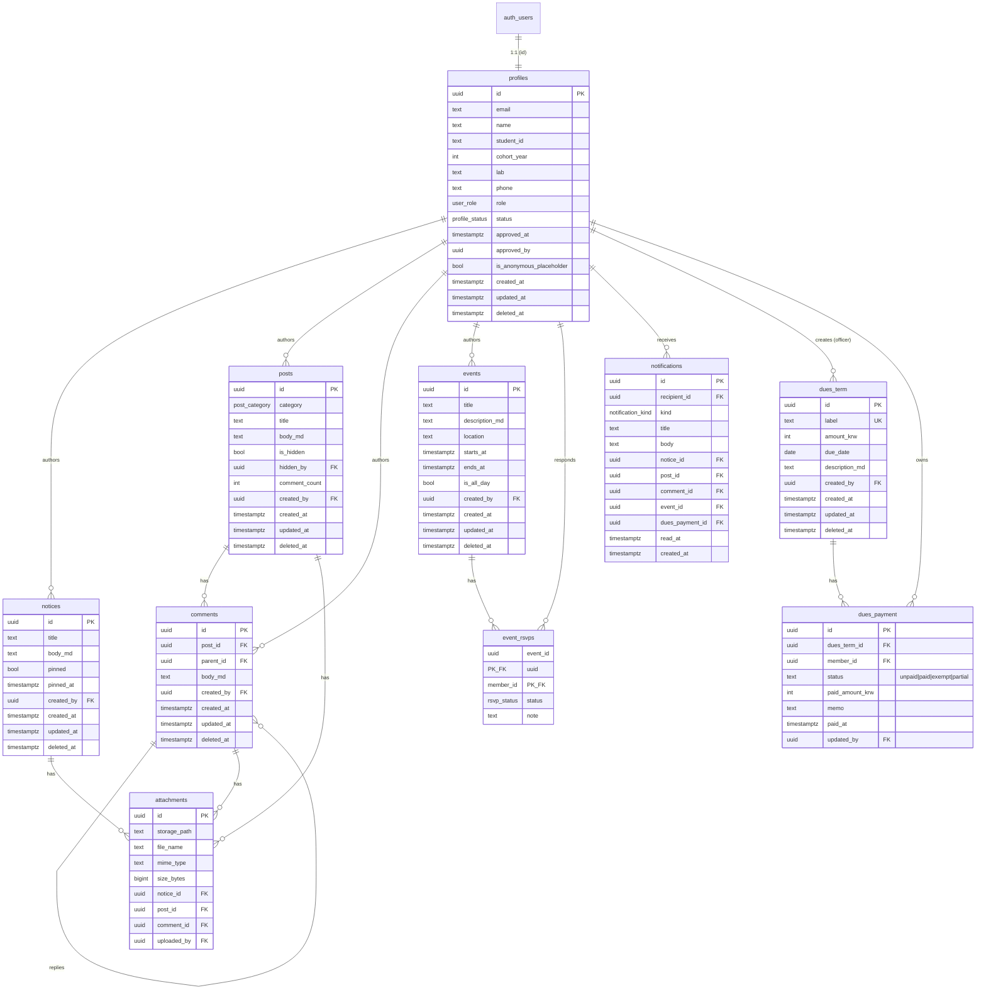

# 03. Backend 설계 문서 — 대학원 원우회 커뮤니티 앱

> 작성자: Backend Engineer 에이전트
> 작성일: 2026-05-20
> 입력: `_workspace/01_pm_requirements.md` v0.2
> 산출물: 이 문서 + `supabase/migrations/*.sql` (9개) + `supabase/seed.sql`

## 변경 로그
| 날짜 | 버전 | 변경 |
|------|------|------|
| 2026-05-20 | v0.1 | PM v0.2 기반 초안. P0 도메인 전체 ERD/DDL/RLS/RPC/seed 완성. |

---

## 1. 기술 스택 결정

| 항목 | 선택 | 사유 |
|------|------|------|
| DB / Auth / Storage | **Supabase (Postgres 15)** | PM이 확정. Auth/RLS/Storage가 한 플랫폼에 묶여 권한 매트릭스를 DB 레이어에서 강제할 수 있다. 운영 인력이 1년 임기 임원이라는 점에서 SaaS의 운영 부담 경감이 결정적. |
| 클라이언트 SDK | `@supabase/ssr` | Next.js 14 App Router 환경에서 RSC/Route Handler/middleware 모두에서 동일한 패턴으로 세션 조회 가능. |
| 추가 백엔드 코드 | 최소화. 필요 시 **Postgres Function(RPC)** 또는 **Edge Function**. | RLS로 표현 가능한 정책은 RLS로, 트랜잭션·집계·권한 가드가 필요한 도메인 액션(가입 승인, 미납자 조회 등)은 SECURITY DEFINER RPC로. |
| 마이그레이션 | `supabase/migrations/{timestamp}_{name}.sql` | Supabase CLI 표준. add-only 원칙. |
| 알림 발송 | P0: DB 트리거로 `notifications` 행 insert (인앱). 이메일은 Supabase Auth 내장(가입/비번 재설정 메일). | PM §6: P0 인앱 알림, P1 웹푸시, P2 이메일 알림. |
| 결제(회비) | 없음. 외부 계좌이체 + 임원 수기 체크. | PM v0.2 §3.5 확정. |

**변경 시 영향**: Supabase가 아닌 자체 백엔드로 가면 (1) 모든 RLS 정책을 애플리케이션 미들웨어로 재구현해야 하고 (2) Storage RLS를 별도로 설계해야 하며 (3) Auth 흐름 전체를 새로 만들어야 함. 변경 권하지 않음.

---

## 2. ERD



### 핵심 관계 정리
- `auth.users` ↔ `profiles`: 1:1, `profiles.id = auth.users.id`. 가입 트리거(`on_auth_user_created`)가 자동 생성.
- 작성자 FK들(`created_by`, `uploaded_by`, `hidden_by`, `approved_by`)은 모두 `on delete set null` — 탈퇴 회원이 있어도 콘텐츠 보존.
- `dues_payment.member_id`는 **NOT NULL + on delete RESTRICT**. 탈퇴 시 anonymous placeholder로 이관해야 의도적으로 보존(PM §6 데이터 보존 정책).
- `event_rsvps`는 (event_id, member_id) 복합 PK.

---

## 3. 테이블별 SQL DDL

실제 파일은 `supabase/migrations/`에 있습니다. 도메인별 분리:

| 파일 | 내용 | 정의 객체 |
|------|------|-----------|
| `20260520000001_init_extensions_and_helpers.sql` | 확장, ENUM, 트리거함수, RLS 헬퍼 | `pgcrypto`/`pg_trgm`/`citext`, `user_role`/`profile_status`/`post_category`/`rsvp_status`/`notification_kind` ENUM, `set_updated_at()`, `current_user_role()` / `current_user_status()` / `is_active_member()` / `is_officer()` / `is_admin()` |
| `20260520000002_profiles.sql` | 회원 프로필 + 가입 트리거 | `profiles`, `handle_new_auth_user()` 트리거, `anonymous_user_id()` |
| `20260520000003_notices.sql` | 공지 | `notices` + FTS GIN 인덱스 |
| `20260520000004_posts_comments.sql` | 게시판 | `posts`, `comments`, `sync_post_comment_count()` 트리거 |
| `20260520000005_events.sql` | 일정 | `events`, `event_rsvps` |
| `20260520000006_dues.sql` | 회비 | `dues_term`, `dues_payment`, `backfill_dues_payments_for_term()` 트리거, `fanout_dues_payments_for_member()` 트리거 |
| `20260520000007_notifications_attachments.sql` | 알림 + 파일 메타 + Storage 버킷 | `notifications`, `attachments`, `storage.buckets` 시드 |
| `20260520000008_rls_policies.sql` | 모든 RLS 정책 + Storage 정책 | 위 10개 테이블의 select/insert/update/delete 정책 |
| `20260520000009_rpc_helpers.sql` | 도메인 RPC | `list_dues_unpaid()`, `approve_membership()`, `reject_membership()`, `mark_all_notifications_read()`, `grant_officer()`, `revoke_officer()` |

### 표준 컬럼 규칙
모든 도메인 테이블은 다음을 갖는다 (조인 테이블 제외):
- `id uuid primary key default gen_random_uuid()`
- `created_at timestamptz not null default now()`
- `updated_at timestamptz not null default now()` — `set_updated_at()` 트리거로 자동
- `deleted_at timestamptz` — 소프트 삭제 (해당되는 경우)
- `created_by uuid references auth.users(id) on delete set null` — 작성자 보존

### 인덱스 전략
- 모든 외래키에 인덱스
- `created_at desc` partial index (`deleted_at is null`) — 목록 페이지 정렬
- `notices`/`posts` 본문 검색: `to_tsvector('simple', title || ' ' || body_md)` GIN. 한국어 토크나이저(`mecab-ko`)는 P1 별도 마이그레이션.
- `profiles.name`에 `gin_trgm_ops` — P1 디렉토리 검색.
- `dues_payment(dues_term_id, status)` — 미납자 조회용.

---

## 4. RLS 정책 요약

모든 public 테이블에 `enable row level security`. 정책은 **whitelist**(허용 정책이 없으면 차단).

### 4.1 역할 헬퍼 (SECURITY DEFINER)
`profiles` 자기참조 RLS 무한루프 방지를 위해 SECURITY DEFINER 함수를 사용:
- `is_active_member()` — `auth.uid()`의 status='active' 여부
- `is_officer()` — role in ('officer','admin') AND active
- `is_admin()` — role='admin' AND active

### 4.2 권한 매트릭스 → 정책 매핑

| 테이블 | 비회원 | 회원(active) | 임원 | 관리자 |
|--------|--------|--------------|------|--------|
| `profiles` SELECT | × | 본인 + 활성 회원 공개정보 | 전체 (pending 포함) | 전체 |
| `profiles` UPDATE | × | 본인 컬럼 한정(앱 레이어 추가 검증) | status 변경 가능 | role 변경 가능 (`grant_officer` RPC 권장) |
| `notices` SELECT | × | ○ (not deleted) | 전체 (삭제 포함) | 전체 |
| `notices` INS/UPD/DEL | × | × | ○ | ○ |
| `posts` SELECT | × | ○ (숨김 글은 본인+임원만) | 숨김 포함 전체 | 동일 |
| `posts` INSERT | × | ○ (created_by=auth.uid()) | ○ | ○ |
| `posts` UPDATE | × | 본인 글만 | 전체 (숨김 토글) | 동일 |
| `comments` | × | SELECT/INSERT/본인 UPD·DEL | 본인 + 타인 DEL | 동일 |
| `events` SELECT | × | ○ | 전체 | 전체 |
| `events` INS/UPD/DEL | × | × | ○ | ○ |
| `event_rsvps` | × | 본인 RSVP CRUD, 타인 RSVP SELECT | 모든 RSVP UPDATE | 동일 |
| `dues_term` SELECT | × | ○ | ○ | ○ |
| `dues_term` INS/UPD/DEL | × | × | ○ | ○ |
| `dues_payment` SELECT | × | **본인 행만** | 전체 | 전체 |
| `dues_payment` UPD | × | × | ○ | ○ |
| `notifications` | × | 본인 SELECT/UPDATE/DELETE | 동일 | 동일 |
| `attachments` SELECT | × | 소유 객체 권한 동일 | 동일 | 동일 |

### 4.3 컬럼 단위 권한 한계
RLS는 행 단위만 강제하므로 다음은 **앱 레이어에서 추가 검증** 필요:
- `profiles.role` / `profiles.status` 변경은 RPC(`grant_officer`, `approve_membership`)로만 (직접 update는 차단 정책 부재 → 클라이언트에서 막아야)
- `posts.is_hidden`은 임원만 토글 (정책 분리되어 있으나 컬럼 단위는 아님)

> **권장**: 민감 컬럼은 server action에서만 update.

---

## 5. API 호출 패턴 (Frontend 가이드)

원칙: Next.js에서 가능한 한 **클라이언트가 직접 Supabase JS SDK를 호출**. 권한 검증·트랜잭션·집계가 필요한 액션만 RPC 또는 Server Action.

### 5.1 클라이언트 셋업
```ts
// lib/supabase/server.ts — RSC/Route Handler용
import { createServerClient } from '@supabase/ssr';
import { cookies } from 'next/headers';
export const supabaseServer = () => createServerClient(
  process.env.NEXT_PUBLIC_SUPABASE_URL!,
  process.env.NEXT_PUBLIC_SUPABASE_ANON_KEY!,
  { cookies: cookies() }
);

// lib/supabase/client.ts — Client Component용
import { createBrowserClient } from '@supabase/ssr';
export const supabase = createBrowserClient(
  process.env.NEXT_PUBLIC_SUPABASE_URL!,
  process.env.NEXT_PUBLIC_SUPABASE_ANON_KEY!,
);
```

### 5.2 도메인별 패턴

#### 공지 (`lib/api/notices.ts`)
```ts
// listNotices(limit=20, cursor?: string)
const { data, error } = await supabase
  .from('notices')
  .select('id, title, body_md, pinned, created_at, author:profiles!created_by(name, role)')
  .order('pinned', { ascending: false })
  .order('created_at', { ascending: false })
  .limit(20);
// Response: Notice[] = { id, title, body_md, pinned, created_at, author: { name, role } | null }

// createNotice(input: { title, body_md, pinned? })  ← 임원만 (RLS가 강제)
await supabase.from('notices').insert({ ...input, created_by: user.id });
```

#### 게시판
```ts
// listPosts({ category?, cursor?, limit=20 })
supabase
  .from('posts')
  .select('id, title, body_md, category, comment_count, created_at, author:profiles!created_by(name)')
  .order('created_at', { ascending: false })
  .limit(20);

// getPost(id)
supabase.from('posts').select('*, author:profiles!created_by(name, role, cohort_year)').eq('id', id).single();

// listComments(post_id)
supabase
  .from('comments')
  .select('id, body_md, parent_id, created_at, author:profiles!created_by(name)')
  .eq('post_id', post_id)
  .order('created_at', { ascending: true });
```

#### 일정
```ts
// listUpcoming(from=now)
supabase.from('events').select('*').gte('starts_at', new Date().toISOString()).order('starts_at');

// listMonth(year, month)
supabase.from('events').select('*').gte('starts_at', from).lt('starts_at', to);

// upsertRsvp(event_id, status)
supabase.from('event_rsvps').upsert({ event_id, member_id: user.id, status });
```

#### 회비
```ts
// listDuesTerms()  — 모든 회원
supabase.from('dues_term').select('*').order('created_at', { ascending: false });

// myDuesStatus(term_id?)  — 본인 행만 RLS로 자동 필터
supabase
  .from('dues_payment')
  .select('id, status, paid_at, memo, updated_at, dues_term:dues_term_id(label, amount_krw, due_date)')
  .eq('member_id', user.id);

// 임원: 회비 매트릭스
supabase
  .from('dues_payment')
  .select('id, status, memo, paid_at, member:profiles!member_id(id, name, cohort_year, lab), term:dues_term_id(label)')
  .eq('dues_term_id', term_id)
  .order('member(cohort_year)');

// 임원: 미납자 목록 (RPC)
supabase.rpc('list_dues_unpaid', { p_dues_term_id: term_id });

// 임원: 상태 토글
supabase.from('dues_payment').update({
  status: 'paid', paid_at: new Date().toISOString(), memo, updated_by: user.id
}).eq('id', payment_id);
```

#### 가입 승인/거부 (RPC)
```ts
// 가입 신청 큐
supabase.from('profiles').select('id, name, email, student_id, cohort_year, created_at').eq('status', 'pending');

// 승인/반려
supabase.rpc('approve_membership', { p_user_id });
supabase.rpc('reject_membership',  { p_user_id, p_reason: '학과 외 인원으로 확인' });
```

#### 알림
```ts
supabase.from('notifications').select('*').order('created_at', { ascending: false }).limit(50);
supabase.from('notifications').update({ read_at: new Date().toISOString() }).eq('id', id);
supabase.rpc('mark_all_notifications_read');
```

### 5.3 응답 shape 규칙
- 작성자 정보는 `author:profiles!created_by(name, role, ...)`로 join.
- `null` 가능: 탈퇴 회원 글은 `author=null` 또는 anonymous placeholder의 name = '(탈퇴회원)'.
- 시간 컬럼은 `timestamptz` → ISO 8601 문자열. 클라이언트는 KST로 포매팅.
- 에러는 `error.code`로 분기 (`PGRST116` = row not found, `42501` = insufficient_privilege).

---

## 6. 인증 흐름

### 6.1 가입 (US-01)
1. 클라이언트에서 `supabase.auth.signUp({ email, password, options: { data: { name, student_id, cohort_year, lab, phone } } })`
2. Supabase Auth가 `auth.users` 행 생성 → 트리거 `on_auth_user_created` 발화
3. 트리거가 `profiles` row 생성 (status='pending', user_metadata 복사)
4. 클라이언트는 "이메일 인증 후 임원 승인을 기다려주세요" 안내 페이지로 라우팅
5. 이메일 인증 완료(`email_confirmed_at` 채워짐) — Supabase 내장 메일러
6. 임원이 `/admin/approvals` 큐에서 `approve_membership(user_id)` RPC 호출
7. profiles.status='active' → 트리거 `trg_profiles_dues_fanout` 발화 → 진행 중인 모든 dues_term에 unpaid 행 자동 생성
8. 회원에게 `notifications` 행 insert (kind='membership_approved')

### 6.2 로그인 (US-02)
1. `supabase.auth.signInWithPassword({ email, password })`
2. Supabase가 httpOnly 쿠키 세팅
3. Next.js middleware (`middleware.ts`)가 모든 요청에서 세션 갱신 + 보호 경로 가드
4. 로그인 직후 `profiles.status` 조회 → `pending`/`suspended`/`withdrawn`이면 안내 페이지로 리다이렉트

### 6.3 세션
- 기본 토큰 만료 1시간, 자동 갱신. `@supabase/ssr`의 middleware helper가 처리.
- 클라이언트 컴포넌트는 `supabase.auth.onAuthStateChange`로 상태 동기화.

### 6.4 비밀번호 재설정 (US-04, P1)
1. `supabase.auth.resetPasswordForEmail(email, { redirectTo: '/auth/reset' })`
2. 사용자가 메일의 매직 링크 클릭 → `/auth/reset`
3. 클라이언트에서 `supabase.auth.updateUser({ password })`

### 6.5 보호 라우트
```ts
// middleware.ts (요약)
const { data: { user } } = await supabase.auth.getUser();
const protected = !/^(\/login|\/signup|\/auth)/.test(pathname);
if (protected && !user) return NextResponse.redirect('/login');
```

---

## 7. 외부 통합

| 통합 | MVP(P0) | 후속 |
|------|---------|------|
| **이메일** | Supabase 내장 메일러로 가입 확인 / 비번 재설정 메일만. 발신자는 Supabase 기본 도메인(`noreply@mail.app.supabase.io`). | P1: 자체 도메인 SMTP 등록(GCP/AWS SES 또는 Resend). 이메일 알림(공지 푸시 대체)은 P2. |
| **푸시 알림** | 없음 (인앱 `notifications` 테이블만) | P1: Web Push (VAPID 키, Service Worker). iOS 16.4+ PWA 푸시 안내 필요. P2: FCM. |
| **결제(회비)** | 없음 — 외부 계좌이체 + 임원 수기 토글 | P2 (US-44): TossPayments/PortOne 등 PG 연동. 별도 결제 도메인 모듈 신설 필요. |
| **파일 저장** | Supabase Storage 버킷 2개 (`attachments` 비공개 10MB, `avatars` 공개 2MB). RLS 정책으로 회원만 접근. | P2: 공지 첨부 활성화 (US-14) — UI만 추가하면 됨, 스키마 준비 완료. |
| **CSV 내보내기** | 없음 | P1 (US-33): 클라이언트에서 RSVP/회비 데이터 받아 csv 생성. |
| **학교 SSO** | 없음 | P2 (US-05): OIDC 연동 (학교마다 다름). |

---

## 부록 A. Frontend에게 전달할 핵심 요약

1. 모든 DB 접근은 `@supabase/ssr` 클라이언트로 직접 호출. RLS가 권한을 강제하므로 클라이언트는 신뢰 코드 작성 불필요.
2. 권한이 필요한 도메인 액션(가입 승인/반려, 미납자 목록, 권한 위임, 알림 일괄 처리)은 모두 `supabase.rpc('함수명', { ... })`로 호출. 함수명/파라미터는 §5 참조.
3. 응답 join 패턴은 `author:profiles!created_by(name, role)` 형태로 통일. 탈퇴 회원은 `name='(탈퇴회원)'`.
4. 게시글/공지 본문은 마크다운(`body_md`). 최대 길이 20,000자. 제목 120자. 댓글 2,000자.
5. 회비 도메인: 임원은 `dues_payment`를 직접 SELECT/UPDATE 가능(매트릭스 UI). 회원은 본인 행만 SELECT 가능(RLS 자동 필터).

## 부록 B. QA에게 전달할 엣지 케이스 & 미검증 항목

### B.1 권한 엣지 케이스
- `profiles.role` 컬럼 직접 update를 일반 회원이 시도하면? → 현재 정책 `profiles_update_self`가 with check에 컬럼 제한이 없음. **앱 레이어 검증 필요** 또는 column-level RLS 추가 마이그레이션 검토.
- 임원이 admin의 role을 member로 변경? → `is_officer()`만 통과하면 됨. RPC `grant_officer`/`revoke_officer`는 `is_admin()`을 요구하지만 직접 update는 막혀 있지 않음. **앱에서 차단 또는 정책 추가** 필요.
- 탈퇴 회원의 `dues_payment` 보존: 현재 `on delete restrict`이므로 회원 삭제 자체가 막힘. soft delete + member_id를 anonymous placeholder로 이관하는 운영 절차 필요 (배치 또는 RPC 미구현 — 추후 추가).

### B.2 Designer 산출물과의 일치 검증 못한 항목
> Designer 산출물(`02_designer_uiux.md`)을 부분 대조한 결과 일관성은 대체로 확보. 다음은 Phase 4 QA에서 교차 확인 필요:

- **테이블명 단/복수**: Designer 시퀀스 다이어그램에서 `dues_payments`(복수)로 표기, backend는 `dues_payment`(단수, PM 힌트 기준). FE 구현 시 단수 사용.
- **회비 상태 'partial'**: Designer SegmentedControl은 `전체|납부|미납|면제` 4종. backend는 'partial'을 추가 정의. UI 노출 여부 결정 필요(현재는 메모로만 처리).
- **회비 매트릭스 컬럼**: Designer SCR-060에 정의된 행 필드(이름/기수/연구실/상태)와 backend select 패턴 일치 — 확인 완료.
- **승인 대기 화면(SCR)**: Designer에 정의됨. backend는 status='pending' 분기로 매핑.
- **공지 본문 최대 길이 20,000자**가 에디터 UX와 맞는지 (Designer가 정한 한도와 다를 수 있음)
- **회비 매트릭스 화면 컬럼 구성**: `member(name, cohort_year, lab)` + `status` + `memo` 노출이 디자인과 일치하는지
- **알림 종류(`notification_kind`) 7종**이 알림 화면의 카테고리/필터와 1:1 매핑되는지
- **회원 디렉토리 노출 필드**(name, cohort_year, lab만 공개)가 디자인과 일치하는지 (PM §6: 학번/연락처는 본인+임원만)
- **회비 상태 4종(`unpaid|paid|exempt|partial`)** 중 'partial'은 PM v0.2가 "메모로 처리"라 했으나 미래 대비로 추가. UI에서 노출할지 결정 필요.
- **첨부파일 P2** — UI 미구현, 스키마만 준비. 디자인 시 무시.

### B.3 부하/규모 가정
- 회원 ≤200명. `dues_term` 생성 시 fanout INSERT 200건 — 트리거 1회로 충분.
- 누적 `dues_payment` 행 수: 200명 × 20학기 = 4,000행. 미납자 조회 O(N).
- 게시글/댓글: 일 10건 미만 예상. FTS GIN으로 충분.

---

## 부록 C. 마이그레이션 실행

```bash
# 신규 환경
supabase db reset                    # 모든 마이그레이션 + seed.sql 실행

# 운영 환경
supabase db push                     # 신규 마이그레이션만 적용
```

마이그레이션은 **add-only**. 기존 파일 수정 금지. 컬럼 변경/삭제는 새 timestamp 파일 추가.
